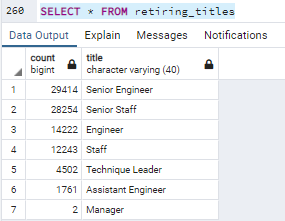
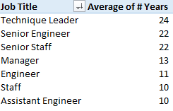
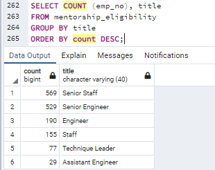
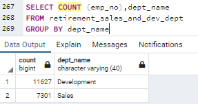
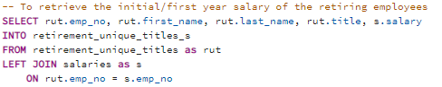
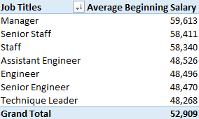
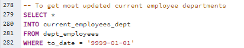
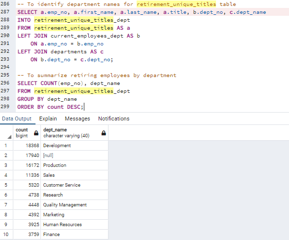

# DABC_Pewlett-Hackard-Analysis
The purpose of the analysis is to determine the impact of a significant number of employees ready for retirement in the near future. By creating a database of employee data comprised of 6 different tables, and executing queries based on the relationship between the abovementioned tables, the analysis aims to gain insights from such queries to assist management in preparing for this transition.

## Resource
- Data source: departments.csv, employees.csv, dept_emp.csv, dept_manager.csv, titles.csv, salaries.csv
- Software: PostgressSQL

## Results:
- As shown in the below table, which shows the number of employees born between the years 1952 and 1955, the company will need to replace over 90,000 employees once these baby boomers retire. Over 60% are either Senior Engineers or Senior Staff, with another 29% being Engineer or staff.

Number of Retiring Employees by Job Title

</img>

- In addition, the retiring employees have been with the company for a very long time. Both Senior Staff and Senior Engineers have been with the company for an average of 22 years. The rest of the retiring employees also have at least 10 years of experience with the company. When they exit the business,  decades of expertise and technical-know-how are leaving with them. It is critical that such expertise and knowledge are preserved by the company with training and mentorship.

Average Number of Years of Service by Job Title

</img>

- Based on the Mentorship Eligibility table, which outlines the number of current employees born in the year 1965, there are only 1,549 eligible to participate. This would imply that the company cannot simply rely on the mentorship program and internal promotions to fill the soon to be vacant positions. The vast majority of the retiring employees would need to be replaced from external hiring.

Number of Current Employees Eligible for Mentorship Program

</img>

- In addition, over 1,000 of the aforementioned eligible employees are already at senior levels (Senior Engineer / Senior Staff). The number of engineers and staff eligible for mentorship and training is insufficient to fill vacant roles. The company should act fast to hire replacements at a large scale, and also expand its mentorship program for current employees to participate.

## Summary
- As mentioned in the Results section, there are over 90,000 roles to be filled as the "silver tsunami" begins to make an impact, majority of them being Senior Staff and Senior Engineers. As shown in below screenshot, there are over 18,000 retirement-ready employees between Sales and Development department who can potentially return to the company as mentors rather than retiring right away, which should be enough. However, the number of current employees eligible for the mentorship program as mentees is a lot less than the number of potential mentors. The company should consider expanding the mentorship program to allow more current employees to participate, rather than only restricting to employees born in 1965.

Retiring Employees in Sales and Development Departments

</img>

- Due to the amount of employees ready to retire, it is important for the company to estimate the cost of new hires in relacement of the retiring employees. The below query could serve as a starting point. The pivot table from the query shows that the average beginning (first year) salary for the departing employees range from 48,000 to 60,000 when they first started at the company, before any promotions and merit increases. Note: the comapny will need to adjust for inflation as many of the retiring employees started at the company over 10 to 20 years ago.

</img>
</img>

- At last, having a closer look at the initial table counts of retiring employees by job title (see below screenshots) reveals that 17,940 of the "retiring employees" have no departments associated with their titles. This is because these employees are no longer with the company (The initial query for "requirement_unique_titles" take into account of the employee's status). As such, we should adjust the number of employees to be replaced from 90,398 to 72,458, with the majority of retireing employees coming from the Developement, Production, and Sales departments.

Number of Retiring Employees by Job Title

</img>

Number of Retiring Employees by Department

</img>

</img>
